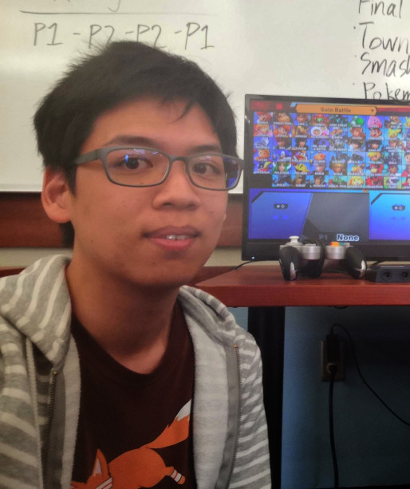

# Computer Science Undergrad Writing Games

Hey! I'm Ryan Chang, a fourth-year at UCI.
I'm majoring in Computer Science, specializing in Algorithms.
I'm also minoring in Mathematics.
I've been programming since before middle school,
with guidance from my brothers. The entire time,
I have been learning and writing games.

### Game Development
In highschool, I began using LibGDX,
a game development framework in Java. This was when I
started my Github account, where many
repositories from that time still exist.

I'm using Godot and Unity. Since I started college,
I have been with the Video Game Development Club at UCI.
I am currently a programming officer at the club.

### More
In my time away from classes and game development,
I regularly play Super Smash Bros. Melee.
To a lesser degree, I also play the other Smash games, Tetris, and Dungeon Crawl: Stone Soup.
