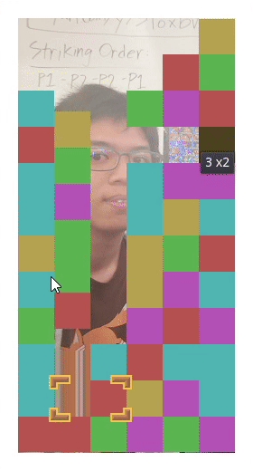
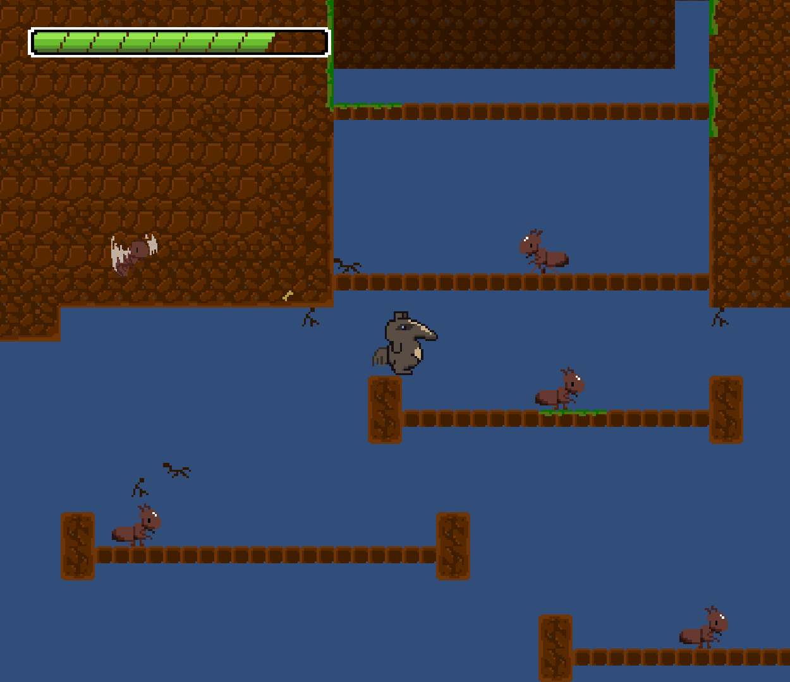
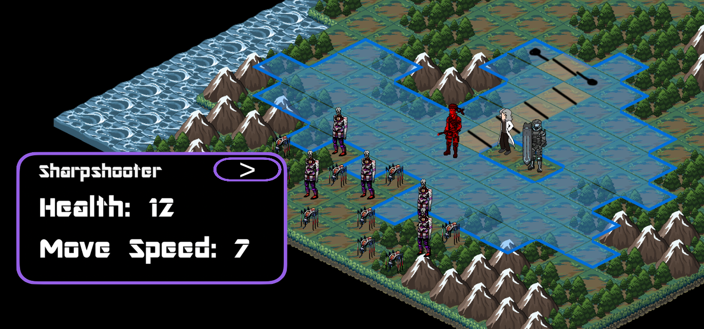

<!-- Hello! I'm Ryan, a fourth-year Computer Science major!

Currently, I'm a programming officer at the Video Game Development Club at UCI.
(My position is "programming director," though I haven't directed anything yet.)
Of course, I write games. I use Godot and Unity and am experienced with both.
Here are some notable things I have worked on. -->

The titles are links to where to most conveniently find the projects.
If possible, they will link directly to the game. If not, they'll link to the Github repository.
Also, you can click on images to expand them (on a computer).

    

        <h2 id="lizard-state"><a href="https://github.com/ArtlessAvian/lizard-state">Lizard State</a></h2>
        

        Lizard State is a traditional roguelike in Godot.
        It has animations, similar to the "Mystery Dungeon" series.
        It has been my pet project over quarantine.
        
 

        The focus of this project is its architecture. 
        With lots of prototyping and changing plans, I've gone through many iterations trying to best design everything.
        <!-- It feels Sisyphean to repeatedly design and scrap things, but with my effort, I now have a solid base to work on. -->
        
 

        My current architecture is based on model-view-viewmodel.
        It can be a bit cumbersome, but I'm liking it very much.
        

        Between the current iteration, previous attempts, and external experiements,
        <ul>
            <li> I've completely decoupled model and view, using an event queue to communicate between the two. </li>
            <li> I've implemented a vision and fog of war system. </li>
            <li> I've built an pathfinding AI to follow teammates and attack enemies. </li>
            <li> I've generated maps using cellular automata and perlin noise. </li>
        </ul>
    

    

        
        
    

    

        
    

    

        <h2 id="overload"><a href="https://artlessavian.itch.io/overload-super-unfinished">Overload</a></h2>
        

        Overload is a falling blocks puzzle game in Godot.
        This was a prototype I worked on by myself to pitch to VGDC@UCI. 
        
 

        For code, this game's design avoids excessive objects,
        an issue with
        <a href="https://github.com/kc34/tetris-attack-clone">an earlier project</a>
        I did with my brother many years before this project.
        There, the board is represented as a 2D array of block objects.
        Each block object was stateful.
        
 

        Rather than have every block be an object, I kept it simple.
        The board is represented by a jagged array of integers.
        The number of extra objects is kept minimal.
        For example, an entire column of falling blocks would be one object.
        This approach was perfect for this game,
        and it even allowed me to create unit tests and to apply test-driven development.
        
 

        As is, it is an exact clone of the SNES game Tetris Attack.
        <!-- I pitched the game to the game development club to get a team to help -->
        <!-- declone the game. However, I didn't make much progress. -->
        <!-- 
 
 -->
        <!-- Even so, on the management end it was a good learning experience. -->
        <!-- I'd like to continue working on this. -->
        

    

    

        
    

    

        <h2 id="antsylvania"><a href="https://github.com/jaedan3/Castlevania-Fall-2019">Antsylvania</a></h2>
        

        Antsylvania is an action adventure platformer game in Unity.
        I was a programmer, acting as a bit of a tech lead.
        
 

        I experimented with making custom physics for the player controller.
        I built the camera system and a hitbox collision system.
        
 

        Unfortunately, our team decided not to submit our game to itch.io. 
        

    

    

        
    

    

        <h2 id="rogue-synthesis"><a href="https://johantan.itch.io/rogue-synthesis">Rogue Synthesis</a></h2>
        

        Rogue Synthesis is a turn based strategy game in Unity.
        I was a programmer, volunteering to work on systems.
        
 

        I implemented pathfinding for a directional move system with weighted tiles.
        I built a system to draw paths.
        I designed a camera that can be smoothly panned both by player controls and by code.
        

    

    

        
    

